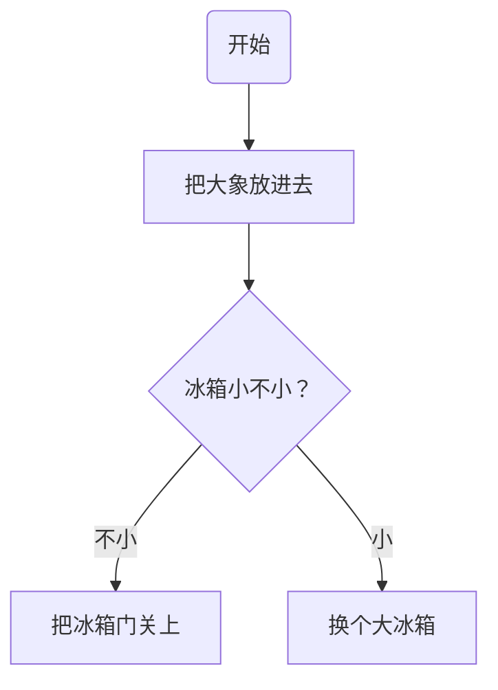

# markdown语法笔记

## 标题
* 用#号标记
* 标题文字下一行用任意个"="或"-"标记，分别代表一级和二级标题
-----
## 列表
### 无序列表
* 用"-"、"*"、"+"作标记
### 有序列表
* 用数字加"."作标记
### 多级列表
- 在子列表的符号之前加入两个或者四个空格即可
-----
## 引用
* ">"
-----
## 强调(加粗、斜体、删除、下划线)
- 加粗：\*\*加粗文本\*\* or \_\_文本\_\_
- 斜体：\*文本\* or \_文本\_
- 加粗斜体： \*\*\*文本\*\*\* or \_\_\_文本\_\_\_
- 删除：文字的两端加两个波浪线 eg：~~你好~~
- 下划线：格式为：\<u>文本\<u>
----
## 分割线
* 一行中用三个及以上的星号、减号、底线来建立一个分隔线，行内不能有其他东西。你也可以在星号或是减号中间插入空格
****
## 换行和段落
* 两个空格加回车换行，空一行则开始新的段落
----
## 代码
````python
  print("abd")
````

## 流程图

**流程图方向**
* TB 从上到下
* BT 从下到上
* RL 从右到左
* LR 从左到右
* TD 同TB


